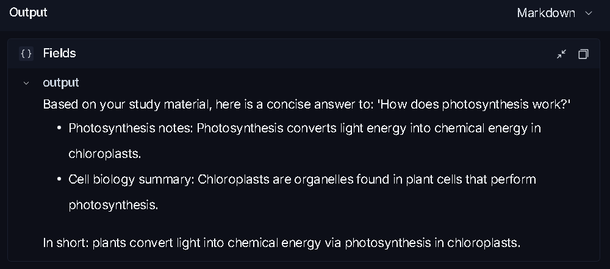

# StudyBuddy.io

StudyBuddy.io is a focused AI study companion. Ask questions in a chat interface, attach study files, and receive streamed explanations from an AI assistant. The project also includes semantic search so the assistant can find relevant material by meaning instead of relying only on exact keywords.

## Core Concepts

### Conversational learning

The React client keeps the current conversation in `useChat`, sends messages to the Supabase `chat` Edge Function, and renders the streamed response as it arrives. The interface is intentionally simple: a welcome screen, chat history, file attachments, and a clear-chat action.

### Retrieval-augmented responses

Study material is stored in Postgres with a 1536-dimensional embedding generated by `text-embedding-3-small`. When a user asks a question:

1. The chat function creates an embedding for the question.
2. Postgres uses `pgvector` cosine similarity to find related material.
3. The matching content is added to the model context.
4. The AI response is streamed back to the browser.

This makes the assistant useful with a personal study library, even when the user's wording does not exactly match the source material.

### File attachments

Uploaded files are stored in the private `chat-attachments` Supabase Storage bucket. Text-based files such as Markdown, JSON, CSV, YAML, XML, and plain text are read by the chat function and included in the current prompt. Binary files are acknowledged but are not parsed.

### Server-side AI and data access

The browser calls Supabase instead of exposing AI credentials. Edge Functions handle AI requests, embeddings, storage downloads, and vector search using server-side environment variables.

## Project Structure

```text
src/
  components/          Chat UI and reusable shadcn components
  hooks/useChat.ts     Client-side conversation and streaming logic
  pages/Index.tsx      Main StudyBuddy screen
  integrations/       Supabase client and generated types
supabase/
  functions/chat/      Streaming chat, attachments, and retrieval
  functions/study-materials/
                       Index and search study content
  functions/_shared/   LangSmith tracing helpers
  migrations/          Storage and pgvector database setup
llmops/                Python LangSmith practice demo
```

## Technology

- React 18 and TypeScript
- Vite
- Tailwind CSS and shadcn/ui
- Supabase Postgres, Storage, and Edge Functions
- `pgvector` for semantic similarity search
- Lovable AI Gateway with Gemini chat completions and text embeddings
- LangSmith for RAG tracing (Edge Functions + Python `llmops/` demo)

## Local Setup

### Requirements

- Node.js and npm
- A Supabase project
- Supabase CLI, if you want to run migrations or deploy functions
- A configured `LOVABLE_API_KEY`

### Install and run the frontend

```bash
npm install
npm run dev
```

Copy [`.env.example`](.env.example) to `.env` and fill in values. The Vite app needs:

```env
VITE_SUPABASE_URL=your_supabase_project_url
VITE_SUPABASE_PUBLISHABLE_KEY=your_supabase_publishable_key
```

LangSmith keys must **not** use a `VITE_` prefix. They stay on the server (`supabase secrets`) and in the gitignored `.env` used by `llmops/`.

### Configure the backend

Apply the database migrations and deploy both functions:

```bash
supabase db push
supabase functions deploy chat
supabase functions deploy study-materials
supabase secrets set LOVABLE_API_KEY=your_lovable_api_key
```

## LangSmith Observability

Production traces come from the Deno Edge Functions (`chat` and `study-materials`). They wrap retrieval, embeddings, and generation with LangSmith `traceable` via [`supabase/functions/_shared/langsmith.ts`](supabase/functions/_shared/langsmith.ts). If `LANGCHAIN_API_KEY` is missing, tracing is skipped and chat still works.

The [`llmops/`](llmops/) folder is a Python practice layer (`load_dotenv` + `@traceable`). It does not replace the Edge Functions. See [`llmops/README.md`](llmops/README.md).

Set these variables in gitignored `.env` (placeholders only in `.env.example`):

```env
LANGCHAIN_TRACING_V2=true
LANGCHAIN_ENDPOINT=https://api.smith.langchain.com
LANGCHAIN_API_KEY=ls__your_langsmith_api_key_here
LANGCHAIN_PROJECT=StudyBuddy-RAG-Monitoring
```

For deployed functions:

```bash
supabase secrets set LANGCHAIN_TRACING_V2=true
supabase secrets set LANGCHAIN_ENDPOINT=https://api.smith.langchain.com
supabase secrets set LANGCHAIN_API_KEY=your_langsmith_api_key
supabase secrets set LANGCHAIN_PROJECT=StudyBuddy-RAG-Monitoring
```

After a chat message or `python llmops/rag_trace_demo.py`, open [LangSmith](https://smith.langchain.com) and inspect project **StudyBuddy-RAG-Monitoring**.

### LangSmith example

A simple example in the public assets shows the type of question-and-answer trace this setup can produce. In the sample image, the prompt was: **"How does photosynthesis work?"** and the answer is captured in the screenshot below.




## Index Study Material

The `study-materials` function accepts two actions. Use `index` to create an embedding and save a document, or `search` to query the vector database directly.

Example request body for indexing:

```json
{
  "action": "index",
  "title": "Photosynthesis notes",
  "content": "Photosynthesis converts light energy into chemical energy...",
  "source": "biology-notes.md"
}
```